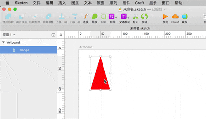

# Icon Scope | 图标结界

`ctrl alt cmd i`

Wrap the Icon with a square(4n) scope.

以图标中心点为中心，创建一个最接近的以4为倍数的透明正方形，然后用一个Group包裹图标和背景。

## Installation

- [Download](../../releases/download/plugin.sketchplugin.zip) the latest release of the plugin
- unzip and double click on the plugin.sketchplugin
